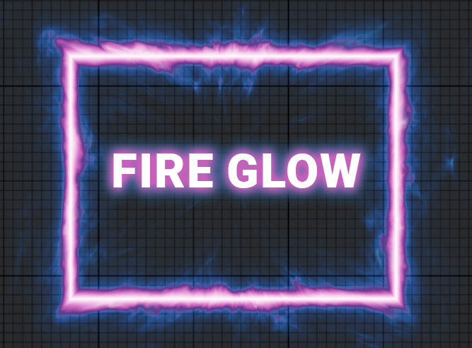

# Fire Glow for Defold

A shader to create a magical glow that you can use in your games, for example to highlight objects or GUI elements, and to create a portal effect.

Based on: [https://www.shadertoy.com/view/4dSfDK](https://www.shadertoy.com/view/4dSfDK)

## Setup

### Dependency

To integrate the **Fire Glow** extension into your own project, add this project as a [dependency](https://www.defold.com/manuals/libraries/) in your **Defold** game. Open your `game.project` file and add the following line to the dependencies field under the project section:

> [https://github.com/ufgo/fire_glow/archive/master.zip](https://github.com/ufgo/fire_glow/archive/master.zip)  

### Online demo [here](https://on.itch.io/fire-glow)

### Note: 
This shader does not work on the mobile version of HTML5. If you know how to fix it, please submit a pull request.

## License

